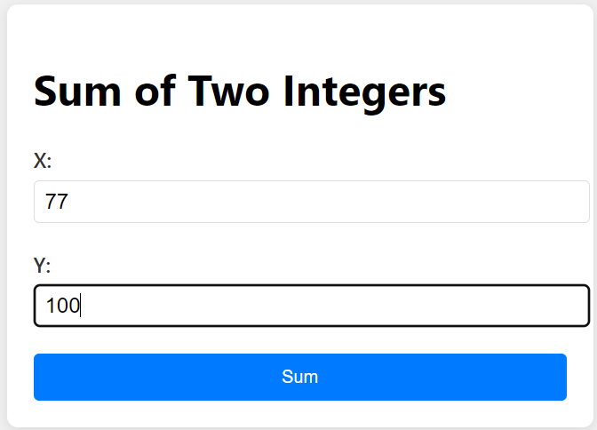

# Calculator App

This is a simple web-based calculator application that allows users to calculate the sum of two integers. The app is built using `Flask` for the backend, `HTML` and `CSS` for the frontend, and `MySQL` for storing calculation history.

## Table of Contents
- [Features](#features)
- [Technologies Used](#technologies-used)
- [Setup Instructions](#setup-instructions)
- [Usage](#usage)
- [Database Schema](#database-schema)
- [Screenshots](#screenshots)
- [Contributing](#contributing)
- [License](#license)

## Features

- Simple Calculator: Users can enter two integers to get the sum.
- Form Validation: Ensures both inputs are valid integers before performing the calculation.
- Database Integration: Calculation results are stored in a MySQL database for record-keeping.
- Flash Messages: Visual feedback to the user after a successful or unsuccessful operation.
- Error Handling: Handles database connection errors and form validation errors gracefully.

## Technologies Used

- Backend: Flask (Python)
- Frontend: HTML5, CSS3 (Bootstrap or any custom CSS framework)
- Database: MySQL

## Setup Instructions

### Prerequisites

Before you begin, ensure you have the following installed:
- Python 3.x
- Flask
- MySQL server
- MySQL Connector for Python
- Any virtual environment manager (e.g., `venv`) "optional"

### Step-by-Step Guide

1. Clone the Repository(Optional)

   ```bash
   git clone https://github.com/abok-cymk/calculator-app.git
   cd calculator-app
   ```

2. Create a Virtual Environment and Activate It (Optional)

   ```bash
   python3 -m venv venv
   source venv/bin/activate   # On Windows: venv\Scripts\activate
   ```

3. Install Dependencies

   Install the required Python libraries:
   I have not used virtual environment here, but it is good practice to use one

   ```bash
   pip install -r requirements.txt
   ```

4. Database Setup

   - Ensure that MySQL is running on your machine.
   - Create the database and table:

   ```sql
   CREATE DATABASE calculator_db;
   USE calculator_db;

   CREATE TABLE calculations (
       id INT AUTO_INCREMENT PRIMARY KEY,
       number_x INT NOT NULL,
       number_y INT NOT NULL,
       result INT NOT NULL,
       timestamp TIMESTAMP DEFAULT CURRENT_TIMESTAMP
   );
   ```

   Update the database credentials in `app.py`:

   ```python
   DATABASE_HOST = "localhost"
   DATABASE_USER = "root"
   DATABASE_PASSWORD = "yourpassword"
   DATABASE_NAME = "calculator_db"
   ```

5. Run the Application

   Start the Flask development server:

   ```bash
   python app.py
   ```

   The app will be accessible at `http://localhost:5000/`.


## Usage

1. Open the application in a web browser.
2. Click the `Sum` button to open the form
3. Enter two integers in the form.
4. Click the `Sum` button to compute the sum.
5. The result is displayed, and the calculation is stored in the database for future reference.

### Example Interaction:

1. Input: `3` and `7`
2. Output: `10` (Result is displayed as: 3 + 7 = 10)


## Database Schema

The `calculations` table stores the following data:

| Column Name | Data Type | Description                          |
|-------------|------------|--------------------------------------|
| id          | INT        | Primary key, auto-incremented        |
| number_x    | INT        | First number                         |
| number_y    | INT        | Second number                        |
| result      | INT        | Sum of number_x and number_y         |
| timestamp   | TIMESTAMP  | Automatically stores the calculation timestamp |

## Screenshots

Here are some screenshots showcasing the app's functionality:

- Home Page: This is the landing page where users input the numbers.
  
  

- Calculation Result: After inputting the numbers, the result is displayed, and users are shown a success message.
  
  

- Error Handling: If the user enters invalid input, appropriate error messages are displayed.
  
  

## Contributing

Contributions are welcome! Please follow these steps:

1. Fork the project.
2. Create a new feature branch (`git checkout -b feature/AmazingFeature`).
3. Commit your changes (`git commit -m 'Add some AmazingFeature'`).
4. Push to the branch (`git push origin feature/AmazingFeature`).
5. Open a pull request.

## Acknowledgements

Thanks to everyone who contributed or inspired this project.

